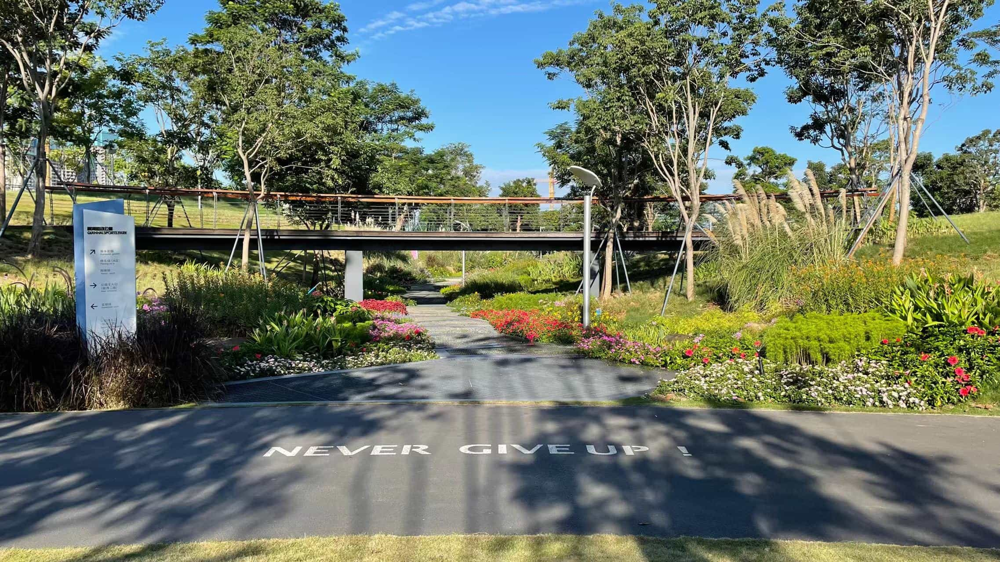

# 不负时光，迎接美好

我将继续努力，长久地保持这种状态，不懈怠，积极地迎接未来每一天的美好。

<!--more-->

## 时间

前几天，帮表妹下载一些英文的[地理空间]^(geospatial)编程资料，顺便聊了一会儿。

我跟她分享了我最近的状态，每天都是规律的作息、锻炼、看书和学习，让她非常羡慕。她的原话是“好羡慕你现在还有这么多时间可以学习，所以珍惜吧”。

表妹从博士毕业之后，在中科院工作了很多年，最近几年去了一所大学任教。非常干练的她想做的事情也很多，却一直没有办法全身心地投入到事业中。她的原话是“我就半个人都算不上了，就是心有余力不足的感觉，心比天高，非常恼火，一堆事，然后娃又要人陪”。

我一下子就想到了我大学的学院院长，她在去年的一堂课上说：“现在，我的孩子们都在国外生活，丈夫也很忙。我真的感觉太幸福了！因为，我终于可以有大把的时间，投入到我想研究的课题中，持续地把研究做的很深入，也更容易出成果了。”

我转述给表妹之后，她的原话是：“哈哈哈，但是也有些人觉得这种日子很孤独，当然我会觉得无比幸福，我很享受可以美美干一天活的状态。”

## 反思

回到自己身上，从成都来到深圳已经有两年多了，这两年多我的变化和成长是非常大的，却也是建立在牺牲了家庭的基础上，在丈夫、父亲和儿子这些角色上的责任缺失所换来的，深感惭愧。
虽然我一直在说现在的牺牲是为了能够更好的回归到家庭，给家人们更好的生活，内心也是这样认为的。但还是在过去的两年里浪费了太多的时间，也忽视了健康。

我真的应该清醒的认识到，人到中年，还能有大把的可自由支配的时间和精力，是多么的难能可贵！我应该把这些宝贵的时间，尽可能多的花在学习和锻炼上，在回归家庭之前，更快的积累知识和具备健康的体魄，才能真正的不负时光，不负家庭，给家人们创造更好的生活！

## 迎接

今天早晨，我发了一条朋友圈，内容是：“早睡早起，看几页书，背几十个单词，悠哉悠哉地出门，呼吸着清新空气，沐浴着暖阳，看着蓝天白云，听着极客时间，时而行走，时而小跑，感受沿途的绿植，穿过锻炼氛围满满的运动公园，元气满满的进入公司，开启崭新的一天！”。

真实地记录了最近两周里每天早上的愉悦感受，我也将继续努力，长久地保持这种状态，不懈怠，积极地迎接未来每一天的美好。

