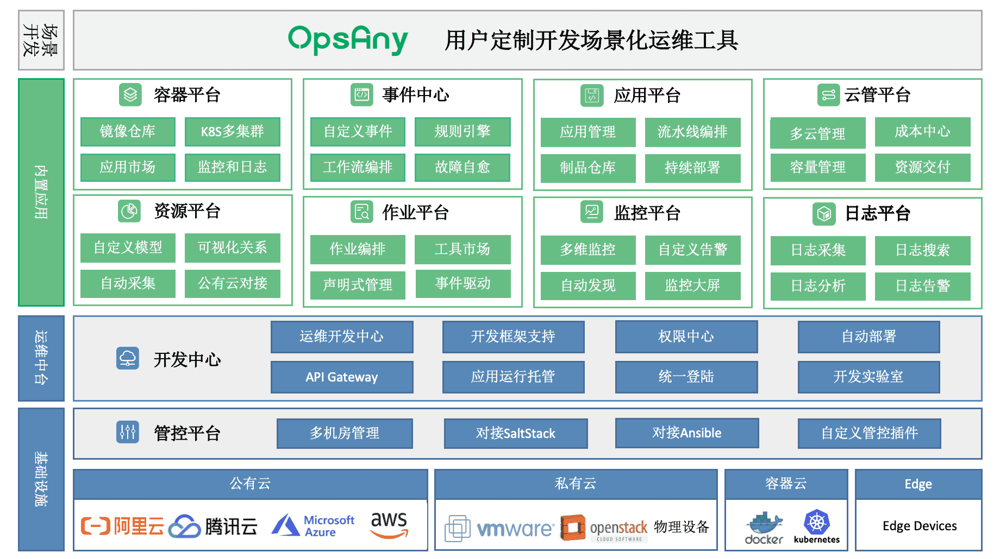

# 为什么要采用多云架构

多云架构使组织可以利用每个平台的优势，同时最大程度地减少缺点。

<!--more-->

## 原因

多云架构使组织可以利用每个平台的优势，同时最大程度的减少缺点，我总结的主要原因有以下几点：

+ 自主选择

  多云基础设施可以结合每个平台提供的最佳服务，从而优化云投资的回报，赋予灵活性，避免因为与供应商的强绑定受到限制。

+ 避免灾难

  不要把所有的鸡蛋放在同一个篮子里。如果一个供应商出现基础设施崩溃、攻击或地缘政治风险，可以迅速地将服务切换到另一个云服务提供商。

+ 安全合规
  
  多云环境可以帮助企业实现安全治理、风险管理和合法合规的目标。

## 架构

下面这张**多云管理平台功能架构图**，出自[赵班长的公司]^(北京速云科技有限公司)自主研发的拳头产品[[OpsAny]^(Make Ops Perfect)](https://www.opsany.com)，从中可以看出在多云架构中所需要考虑到的各项服务模块，也不难体会到建设一个多云管理平台所需要面临的诸多挑战。

