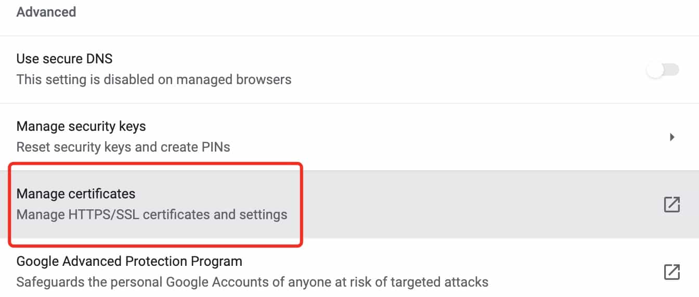

# 如何创建自签名SSL证书支持私有域名的HTTPS服务


在互联网全站HTTPS的时代，内部私有域名的HTTPS服务部署也尤为重要。

<!--more-->

## 背景

如今，几乎所有的互联网网站和应用都已经是全站HTTPS了，但很多企业的内部应用还仍然为了方便而采用HTTP的方式在“裸奔”。

在我目前的工作中，内部安全抓的很紧，所有的应用都必须支持HTTPS才能部署上线。于是，我在这里将创建自签名SSL证书的笔记分享出来，供大家参考。

## 生成SSL证书

### 1. 生成根证书并导入
首先生成根证书的Key`rootCA.heylinux.com.key`，设置加密长度为`4096`以满足安全级别要求。

```bash
openssl genrsa -out rootCA.heylinux.com.key 4096
```

使用根证书的Key`rootCA.heylinux.com.key`生成根证书文件`rootCA.heylinux.com.pem`，设置加密方式为`sha256`，有效期为`3650天`，证书的机构信息为`/C=CN/ST=Sichuan/L=Chengdu/O=HEYLINUX/OU=IT/CN=SRE`。

```bash
openssl req -x509 -new -nodes -key rootCA.heylinux.com.key -sha256 -days 3650 -out rootCA.heylinux.com.pem -subj "/C=CN/ST=Sichuan/L=Chengdu/O=HEYLINUX/OU=IT/CN=SRE"
```

将生成的根证书文件`rootCA.heylinux.com.pem`通过Chrome浏览器导入到操作系统中，就可以让浏览器信任之后基于根证书所生成的服务端证书。


### 2. 生成SSL服务端证书

创建服务端证书配置文件`ssl.conf`，支持`serverAuth`和`clientAuth`，可用于多个泛域名`*.heylinux.com`和`*.cloud.heylinux.com`。

```bash
vim ssl.conf
```

```ini
subjectAltName = @alt_names
authorityKeyIdentifier = keyid,issuer
keyUsage = digitalSignature,keyEncipherment,nonRepudiation,dataEncipherment
extendedKeyUsage = serverAuth,clientAuth
basicConstraints = CA:FALSE
subjectKeyIdentifier = hash

[alt_names]
DNS.1 = *.heylinux.com
DNS.2 = *.cloud.heylinux.com
```

生成服务端证书的Key,文件名`star.heylinux.com.key`，机构信息设置为`/C=CN/ST=Sichuan/L=Chengdu/O=HEYLINUX/OU=IT/CN=*.heylinux.com`。

```bash
openssl req -new -nodes -out star.heylinux.com.csr -newkey rsa:4096 -keyout star.heylinux.com.key -subj "/C=CN/ST=Sichuan/L=Chengdu/O=HEYLINUX/OU=IT/CN=*.heylinux.com"
```

通过根证书的Key、根证书、服务端证书的Key和服务端证书配置文件`ssl.conf`，生成服务端证书，文件名`star.heylinux.com.crt`，设置加密方式为`sha256`，有效期为`3650天`。

```bash
openssl x509 -req -in star.heylinux.com.csr -CA rootCA.heylinux.com.pem -CAkey rootCA.heylinux.com.key -CAcreateserial -out star.heylinux.com.crt -days 3650 -sha256 -extfile ssl.conf
```

查看服务端证书信息。

```bash
openssl x509 -text -noout -in star.heylinux.com.crt
```

```
Certificate:
    Data:
        Version: 3 (0x2)
        Serial Number:
            10:f8:04:91:06:d8:4a:eb:46:ee:90:80:b4:9c:94:4e:ac:60:7b:3e
        Signature Algorithm: sha256WithRSAEncryption
        Issuer: C = CN, ST = Sichuan, L = Chengdu, O = HEYLINUX, OU = IT, CN = SRE
        Validity
            Not Before: Nov  7 04:38:21 2021 GMT
            Not After : Nov  5 04:38:21 2031 GMT
        Subject: C = CN, ST = Sichuan, L = Chengdu, O = HEYLINUX, OU = IT, CN = *.heylinux.com
        Subject Public Key Info:
            Public Key Algorithm: rsaEncryption
                RSA Public-Key: (4096 bit)
...
                Exponent: 65537 (0x10001)
        X509v3 extensions:
            X509v3 Subject Alternative Name:
                DNS:*.heylinux.com, DNS:*.cloud.heylinux.com
            X509v3 Authority Key Identifier:
                keyid:36:20:25:BA:1A:D9:36:A3:5C:E7:94:30:7F:76:D5:DF:5D:03:99:C9

            X509v3 Key Usage:
                Digital Signature, Non Repudiation, Key Encipherment, Data Encipherment
            X509v3 Extended Key Usage:
                TLS Web Server Authentication, TLS Web Client Authentication
            X509v3 Basic Constraints:
                CA:FALSE
            X509v3 Subject Key Identifier:
                DB:0D:E8:00:A4:3E:95:71:26:1A:0B:57:4C:3C:3B:33:D3:67:F0:16
...
```
### 3. 生成不同格式的捆绑证书

[捆绑证书]^(certificate bundle)通常包含多个服务端证书Key和服务端证书。

生成`PKCS12`格式的捆绑证书`star.heylinux.com.p12`，设置证书文件的[密码]^(passphrase)为`P_Ss0rdT`，文件内别名`heylinux_com`，这种证书可用于服务器软件如Tomcat。

```bash
openssl pkcs12 -export -in star.heylinux.com.crt -inkey star.heylinux.com.key -password pass:P_Ss0rdT -name heylinux_com -out star.heylinux.com.p12
```

将生成好的`PKCS12`格式的捆绑证书`star.heylinux.com.p12`转换为`JKS`格式`star.heylinux.com.jks`，设置证书文件的[密码]^(passphrase)为`P_Ss0rdT`，文件内别名`heylinux_com`，这种证书可用于Java类应用的服务器软件如Tomcat。

```
keytool -importkeystore -deststorepass P_Ss0rdT -destkeystore star.heylinux.com.jks -srcstorepass P_Ss0rdT -srckeystore star.heylinux.com.p12 -srcstoretype PKCS12
```

将生成好的`PKCS12`格式的捆绑证书`star.heylinux.com.p12`转换为`PEM`格式`star.heylinux.com.pem`，文件内别名`heylinux_com`，不设置证书文件的密码，这种证书可用于服务器软件如Apache、Nginx、HAProxy和AWS ELB。

```
openssl pkcs12 -password pass:P_Ss0rdT -in star.heylinux.com.p12 -out star.heylinux.com.pem -nodes
```

### 4. 将根证书转换为JKS格式

将根证书`rootCA.heylinux.com.pem`转换为`JKS`格式`rootCA.heylinux.com.jks`，文件内别名`heylinux_com`，用于Java类应用对服务端证书进行校验，原理类似于上面“导入到操作系统中，就可以让浏览器信任之后基于根证书所生成的服务端证书”。

```bash
# 先生成rootCA.heylinux.com.der
openssl x509 -in rootCA.heylinux.com.pem -out rootCA.heylinux.com.der -outform der

# 查看rootCA.heylinux.com.der
keytool -v -printcert -file rootCA.heylinux.com.der

# 再将rootCA.heylinux.com.der转换为rootCA.heylinux.com.jks
keytool -importcert -alias heylinux_com -keystore rootCA.heylinux.com.jks -storepass P_Ss0rdT -file rootCA.heylinux.com.der

# 查看rootCA.heylinux.com.jks
keytool -keystore rootCA.heylinux.com.jks -storepass P_Ss0rdT -list
```

## 转换和查看SSL证书

### 1. 从P7B到PEM

将Windows生成的根证书`SubCA_2.p7b`从`P7B`格式转换为`PEM`格式`rootCA.heylinux.com.pem`。

```bash
openssl pkcs7 -inform DER -print_certs -in SubCA_2.p7b -out rootCA.heylinux.com.pem
```

### 2. 从PEM到JKS

将`PEM`格式的根证书`rootCA.heylinux.com.pem`转换为`JKS`格式`rootCA.heylinux.com.jks`。

```bash
# 生成rootCA.heylinux.com.der
openssl x509 -in rootCA.heylinux.com.pem -out rootCA.heylinux.com.der -outform der

# 生成rootCA.heylinux.com.jks, 文件内别名heylinux_com
keytool -importcert -alias heylinux_com -keystore rootCA.heylinux.com.jks -storepass P_Ss0rdT -file rootCA.heylinux.com.der
```

### 3. 从PFX(P12)到PEM

将`PFX(P12)`格式的证书`star.heylinux.com.pfx`转换为`PEM`格式`star.heylinux.com.pem`，通常`star.heylinux.com.pem`包含了服务端证书Key和服务端证书，可以手动将其中的内容分别复制出来，生成服务端证书Key`star.heylinux.com.key`和服务端证书`star.heylinux.com.crt`。

```
openssl pkcs12 -password pass:P_Ss0rdT -nodes -in star.heylinux.com.pfx -out star.heylinux.com.pem
```

### 4. 从P12到JKS

将`P12`格式的证书`star.heylinux.com.p12`转换为`JKS`格式`star.heylinux.com.jks`，文件内别名`heylinux_com`。

```bash
keytool -importkeystore -deststorepass P_Ss0rdT -destkeystore star.heylinux.com.jks -srcstorepass P_Ss0rdT -srckeystore star.heylinux.com.p12 -srcstoretype PKCS12 -alias heylinux_com
```

### 5. 查看各种格式的证书

```bash
# 查看PEM格式的证书rootCA.heylinux.com.pem和star.heylinux.com.pem
openssl x509 -noout -text -in rootCA.heylinux.com.pem 
openssl x509 -noout -text -in star.heylinux.com.pem

# 查看P12格式的证书star.heylinux.com.p12 
keytool -list -v -keystore star.heylinux.com.p12 -storepass P_Ss0rdT -storetype PKCS12

# 查看JKS格式的证书star.heylinux.com.jks
keytool -list -v -keystore star.heylinux.com.jks -storepass P_Ss0rdT
```

## 无需根证书的TLS/SSL证书

对于一些应用如NiFi、vsFTPd，主要将TLS/SSL证书直接用于客户端与服务端校验，类似于SSH的私钥与公钥间的认证关系，这类TLS/SSL证书可以不需要根证书。

创建服务端证书配置文件`tls.conf`，证书的机构信息为`/C=CN/ST=Sichuan/L=Chengdu/O=HEYLINUX/OU=IT/CN=SRE`，可用于多个IP`10.8.5.7`和`10.2.3.4`，和多个泛域名`*.heylinux.com`和`*.cloud.heylinux.com`。

```bash
vim tls.conf
```

```ini
[req]
prompt = no
req_extensions = req_ext
distinguished_name = dn

[dn]
 C = CN
ST = Sichuan
 L = Chengdu
 O = HEYLINUX
OU = IT
CN = SRE

[req_ext]
subjectAltName = @alt_names

[alt_names]
IP.1 = 10.8.5.7
IP.2 = 10.2.3.4
DNS.1 = *.heylinux.com
DNS.2 = *.cloud.heylinux.com
```

可通过以下方式生成，设置加密方式为`sha256`，有效期为`3650天`，证书文件[密码]^(passphrase)为`P_Ss0rdT`。

```bash
# 生成证书Key heylinux-ssl-keypair.key和证书heylinux-ssl-keypair.crt
openssl req -x509 -newkey rsa:4096 -keyout heylinux-ssl-keypair.key -out heylinux-ssl-keypair.crt -days 3650 -sha256 -extensions req_ext -config tls.conf

# 输入密码
Generating a RSA private key
....................................+++++
writing new private key to 'heylinux-ssl-keypair.key'
Enter PEM pass phrase: P_Ss0rdT
Verifying - Enter PEM pass phrase: P_Ss0rdT

# 将证书Key和证书转换为P12格式的捆绑证书heylinux-ssl-keypair.p12
openssl pkcs12 -export -in heylinux-ssl-keypair.crt -inkey heylinux-ssl-keypair.key -password pass:P_Ss0rdT -name heylinux_ssl_keypair -out heylinux-ssl-keypair.p12

# 输入密码
Enter pass phrase for heylinux-ssl-keypair.key: P_Ss0rdT

# 查看P12格式的捆绑证书heylinux-ssl-keypair.p12
keytool -list -v -keystore heylinux-ssl-keypair.p12 -storepass P_Ss0rdT -storetype PKCS12
```

## 使用cfssl生成和查看SSL证书

### 1. 安装命令行工具

下载命令行工具`cfssl`，`cfssljson`和`cfssl-certinfo`并给予执行权限。

```bash
sudo wget https://pkg.cfssl.org/R1.2/cfssl_linux-amd64 -O /usr/local/bin/cfssl
sudo wget https://pkg.cfssl.org/R1.2/cfssljson_linux-amd64 -O /usr/local/bin/cfssljson
sudo wget https://pkg.cfssl.org/R1.2/cfssl-certinfo_linux-amd64 -O /usr/local/bin/cfssl-certinfo
sudo chmod +x /usr/local/bin/cfssl*
```

### 2. 生成和查看根证书

创建json配置文件`rootCA.json`，生成与上面配置相同的`rootCA.heylinux.com.key`（cfssl不支持证书key与证书长度不一致，因此加密长度仅为2048）和`rootCA.heylinux.com.pem`。

```json
{
    "CA": {
        "expiry": "87600h",
        "pathlen": 0
    },
    "CN": "SRE",
    "key": {
        "algo": "rsa",
        "size": 2048
    },
    "names": [
        {
            "C": "CN",
            "ST": "Sichuan",
            "L": "Chengdu",
            "O": "HEYLINUX",
            "OU": "IT"
        }
    ]
}
```

```bash
cfssl gencert -initca rootCA.json | cfssljson -bare rootCA.heylinux.com
```

```
2021/11/13 05:11:48 [INFO] generating a new CA key and certificate from CSR
2021/11/13 05:11:48 [INFO] generate received request
2021/11/13 05:11:48 [INFO] received CSR
2021/11/13 05:11:48 [INFO] generating key: rsa-2048
2021/11/13 05:11:48 [INFO] encoded CSR
2021/11/13 05:11:48 [INFO] signed certificate with serial number 644632230923530854661361284854682897812867573233
```

```bash
ls -1
```

```
rootCA.heylinux.com.csr
rootCA.heylinux.com-key.pem
rootCA.heylinux.com.pem
rootCA.json
```

```bash
mv rootCA.heylinux.com-key.pem rootCA.heylinux.com.key
```

查看根证书`rootCA.heylinux.com.pem`信息。

```bash
cfssl-certinfo -cert rootCA.heylinux.com.pem
```

```json
{
  "subject": {
    "common_name": "SRE",
    "country": "CN",
    "organization": "HEYLINUX",
    "organizational_unit": "IT",
    "locality": "Chengdu",
    "province": "Sichuan",
    "names": [
      "CN",
      "Sichuan",
      "Chengdu",
      "HEYLINUX",
      "IT",
      "SRE"
    ]
  },
  "issuer": {
    "common_name": "SRE",
    "country": "CN",
    "organization": "HEYLINUX",
    "organizational_unit": "IT",
    "locality": "Chengdu",
    "province": "Sichuan",
    "names": [
      "CN",
      "Sichuan",
      "Chengdu",
      "HEYLINUX",
      "IT",
      "SRE"
    ]
  },
  "serial_number": "644632230923530854661361284854682897812867573233",
  "not_before": "2021-11-12T20:53:00Z",
  "not_after": "2031-11-10T20:53:00Z",
  "sigalg": "SHA256WithRSA",
  "authority_key_id": "36:D1:86:6B:27:AE:24:EF:C7:B3:2B:25:E7:92:DE:F1:0:34:2B:E5",
  "subject_key_id": "36:D1:86:6B:27:AE:24:EF:C7:B3:2B:25:E7:92:DE:F1:0:34:2B:E5",
  "pem": "-----BEGIN CERTIFICATE-----...-----END CERTIFICATE-----\n"
}
```

### 3. 生成和查看SSL服务端证书

创建json配置文件`ssl-config.json`和`ssl.json`，生成与上面配置相同的`star.heylinux.com.key`（cfssl不支持证书key与证书长度不一致，因此加密长度仅为2048）和`star.heylinux.com.crt`。

```bash
vim ssl-config.json
```

```json
{
  "signing": {
    "default": {
      "expiry": "87600h"
    },
    "profiles": {
      "server": {
        "usages": [
          "signing",
          "key encipherment",
          "server auth",
          "client auth"
        ],
        "expiry": "87600h"
      }
    }
  }
}
```

```bash
vim ssl.json
```

```json
{
  "CN": "*.heylinux.com",
  "hosts": [
    "*.heylinux.com",
    "*.cloud.heylinux.com"
  ],
  "key": {
    "algo": "rsa",
    "size": 2048
  },
  "names": [{
    "C": "CN",
    "ST": "Sichuan",
    "L": "Chengdu",
    "O": "HEYLINUX",
    "OU": "IT"
  }]
}
```

```bash
cfssl gencert -ca=rootCA.heylinux.com.pem -ca-key=rootCA.heylinux.com.key -config=ssl-config.json -profile=server ssl.json | cfssljson -bare star.heylinux.com

mv star.heylinux.com.pem star.heylinux.com.crt
mv star.heylinux.com-key.pem star.heylinux.com.key

ls -1
```

```
rootCA.heylinux.com.csr
rootCA.heylinux.com.key
rootCA.heylinux.com.pem
rootCA.json
ssl-config.json
ssl.json
star.heylinux.com.crt
star.heylinux.com.csr
star.heylinux.com.key
```

查看服务端证书`star.heylinux.com.crt`信息。

```bash
cfssl-certinfo -cert star.heylinux.com.crt
```

```json
{
  "subject": {
    "common_name": "*.heylinux.com",
    "country": "CN",
    "organization": "HEYLINUX",
    "organizational_unit": "IT",
    "locality": "Chengdu",
    "province": "Sichuan",
    "names": [
      "CN",
      "Sichuan",
      "Chengdu",
      "HEYLINUX",
      "IT",
      "*.heylinux.com"
    ]
  },
  "issuer": {
    "common_name": "SRE",
    "country": "CN",
    "organization": "HEYLINUX",
    "organizational_unit": "IT",
    "locality": "Chengdu",
    "province": "Sichuan",
    "names": [
      "CN",
      "Sichuan",
      "Chengdu",
      "HEYLINUX",
      "IT",
      "SRE"
    ]
  },
  "serial_number": "608638693485247133136510097809090433439285866629",
  "sans": [
    "*.heylinux.com",
    "*.cloud.heylinux.com"
  ],
  "not_before": "2021-11-12T21:20:00Z",
  "not_after": "2031-11-10T21:20:00Z",
  "sigalg": "SHA256WithRSA",
  "authority_key_id": "2B:D4:44:57:4D:9:D8:9A:0:63:4C:5B:B8:78:F4:8F:45:9C:3C:F5",
  "subject_key_id": "4E:15:55:4A:34:EA:BA:69:3E:A5:F:40:74:16:52:F0:88:C3:7D:6F",
  "pem": "-----BEGIN CERTIFICATE-----...-----END CERTIFICATE-----\n"
}
```

