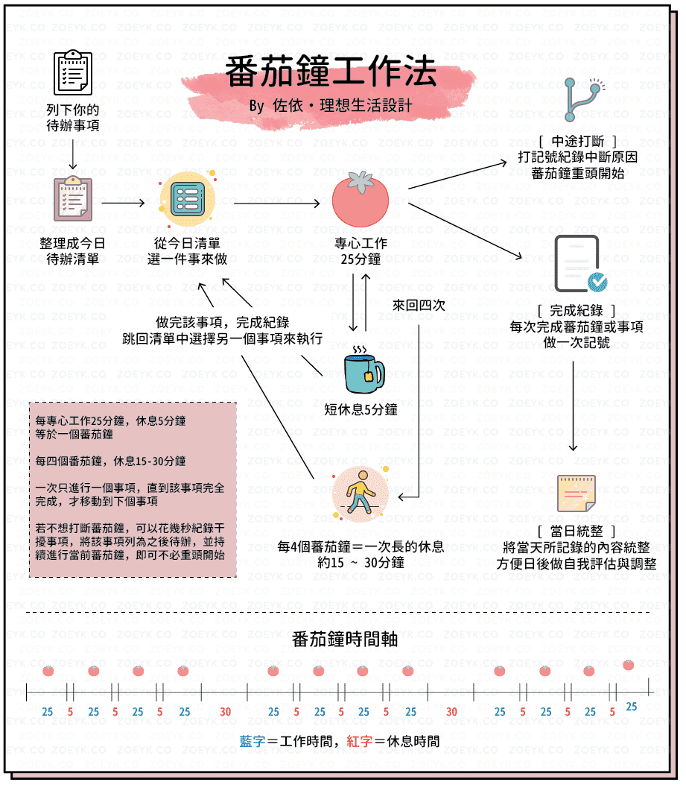
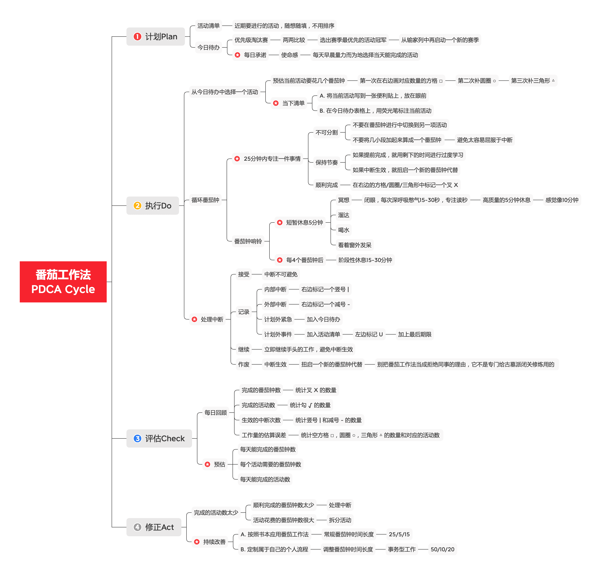

# 读书笔记之《番茄工作法图解》

番茄工作法是一种简单易行的时间管理方法，有张有弛，能够减轻时间焦虑、提升专注力和减少中断。

<!--more-->

## 序

番茄工作法由弗朗西斯科•西里洛于1992年发明，名称源自于一枚形状像番茄的厨房定时器。

番茄工作法是一种简单易行的时间管理方法，流程如下：

1. 选择一项任务
2. 设定番茄钟为25分钟，开始倒计时
3. 专注工作，直到番茄钟响铃
4. 短暂休息5分钟
5. 每4个番茄钟后，阶段性休息15-30分钟



整个流程的确比较简单，但不假思索就直接使用、缺乏对每日周期的理解、不会处理中断、不会调整和定制番茄钟时间长度的话，实施的效果可能会很差。

在《番茄工作法图解：简单易行的时间管理方法》这本书中，包含了一系列的科学理论方法和最佳实践，有效地解决了上述问题，充满启发且行之有效。

## 文摘

### 0. 推荐序

> 频繁的中断、重复的活动、迫近的期限，常常使我们力不从心。而这些压力又是最害人的：它们带来更多的压力、更多的被迫行为、更多的难以为继，同时妨碍了我们自觉、专注、清醒地思考。结果是心智游走在过去未来之间，只为找某个人、某件事来顶罪，掩盖我们虚构中的无能。

> 我所发明的“番茄工作法”，意在让人们驻足、观察、醒悟，并在此过程中改进自我。时间不再是紧绷的弦，反而变成同盟战友，帮我们将100%的心智专注在当下，避免不必要的压力和负担。使用番茄工作法，你将学会微笑达成目标，做强者而无需逞强用力。
    
> 番茄工作法与Scrum、XP等敏捷工作法类似，但它更关注“微观”层面，相当于一个单人团队在执行25分钟的迭代。最大的区别在于，使用敏捷方法，生产率通常意味着在每个迭代完成了多少工作；而使用番茄工作法，生产率意味着每天完成了多少个番茄钟。要完成大量工作，重点不在完成工作上，而在于能否集中注意力！
    
> 番茄钟是个时间管理的好工具。拖拉的人用它，时间变的紧凑高效；勤奋的人用它，工作变得有张有弛。

> 你是否和我一样，工作时，不知不觉地走神去干别的事了。尤其是面对电脑时，坐在网络世界的某个节点上，很容易被外界大量的信息——精彩和垃圾的信息所吸引，于是东摸西摸一阵，其结果，别的事没办成，工作也耽误了。

> 番茄工作法是一套简单的工具和流程，其优点如下：
>
>  + 减轻时间焦虑
>  + 提升集中力和注意力，减少中断
>  + 增强决策意识
>  + 唤醒激励和持久激励
>  + 巩固达成目标的决心
>  + 完善预估流程，精确地保质保量
>  + 改进工作学习流程
>  + 强化决断力，快刀斩乱麻

### 1. 第1章：一次只做一件事

> 要想做到专注，你就得坚决抛开各种杂念。

> 我在公交车上读书的时间相对固定，活动单一，目标单一，成果却很惊人。你只要为自己的“小公交车”确定目的地，并设好闹钟，然后专注在工作上即可。

> 番茄工作法能帮你与时间化敌为友，不会再因为还有一小时、一天、一周、一个月的时限而充满焦虑，你要做的就是定好25分钟番茄钟，然后全然专注于手头的任务。如果番茄钟响铃，25分钟结束，而任务还没完成，这并不代表失败。相反，这铃声在为你已连续地工作了一整段时间而喝彩。

> 别考虑任务有多复杂，重要的是开始、再开始。扭启番茄钟，半小时内你会有所斩获，并获得休息作为奖赏。

> 不要总想着要完成整件事你还得费多少功夫，而是想想要完成这一个番茄钟其实也没多久。先完成它，你就会得到回报。

> 番茄工作法要求在每天早晨做计划，为自己当天分派为数不多的活动。

> 番茄工作法，以25分钟的短期迭代为节奏，帮你建立可持续发展的步伐，休息时安心休息，工作时一心一意。

> 番茄工作法是以动作为导向的，扭启番茄钟是动作，遵守铃声是动作，填写“今日待办”表格是动作。习惯成自然，充分利用条件反射的力量。

> 为了避免第二天犯同样的错误，番茄工作法在一天结束前要做三件事：记录、处理和可视化，这些每日回顾工作，是改进个人流程的关键。每天都学习，每天都进步。这样还有一个好处是，一开始你是按照书本应用番茄工作法，等到认清自身工作习惯后，就可以进行调整，形成自己专属的一套方法。

> 总是把估计值当作承诺，无论是对自己或对同事，都会造成不必要的焦虑。为避免此类困境，番茄工作法只计算番茄钟。就算最后期限迫在眉睫，你也能花25分钟专注于该做的事。

> 完美主义，碍手碍脚。“等一等，还有更完美的方案”其实是另一种形式的拖延。番茄工作法没有给“拖延”任何的机会。你只能前进，开始一个番茄钟，不必惦记怎样才能做到“非常完美”。

### 2. 第2章：背景

> 番茄工作法是简单地让你顺应自己的天性去工作，因势利导，而不是与之对抗。

> 作息时间不规律的人往往更容易迷茫和焦虑。

> 同样，我也已经通过番茄工作法训练了大脑，一扭启番茄钟，就把注意力集中；一到番茄钟响铃，注意力就放松下来。就连咔哒作响的声音现在也能加强我的注意力。这些都是条件反射。

> 我需要休息，以获得新的能量。要让注意力处于最佳状态。

> 思维导图，是理清联想脉络、服务长期记忆的极佳工具。

> 短暂的定期休息，能够促进融会贯通的能力。这就解释了，为何有些解决方案会在我午饭或一夜睡眠后冒出来！

> 吃一堑，长一智，应当更加频繁地提供反馈和接收反馈。

### 3. 第3章：方法

> 番茄工作者的一天具有以下5个阶段：
>
>  + 计划：在一天的开始，从积压的工作（称为“活动清单”）中提取最重要的活动，填写到“今日待办”表格中。这就是你当天的自我承诺。
>  + 跟踪：确定当天活动后，扭启25分钟的番茄钟，从当天活动的第一项开始进行。在每个25分钟的时间段（称为一个番茄钟）内，你要收集一些过程指标，比如计算遇到的终端次数。
>  + 记录：在一天结束时，将当天收集的数据归档，写入“记录”表格。如果你跟踪了中断次数，就把中断次数写下来。
>  + 处理：从所记录的原始数据中提取有用信息。例如，可以计算在每个25分钟的时间段，平均遇到几次中断。
>  + 可视化：最终你要将信息以某种方式组织起来，从中找出改进流程的思路。如果你想获得最适合现实情况的工作习惯，在自我调整过程中，基本上每天都要做这样的回顾。
>
> 在每天开始时，进行计划；每天结束时，进行记录、处理和可视化；在两者之间，进行对25分钟周期循环的跟踪。

> 戴明循环的4步为：计划Plan-执行Do-评估Check-修正Act。番茄工作法是一套典型的PDCA流程。

> “现在就做”是一个很好的原则，可以减少你“不得不做”的工作数量。

> 将最重要的活动排到第一位，并全力以赴去做，有一种脚踏实地的安全感，否则注意力会一直被这样的问题扰乱：“我现在真的在做最重要的事情嘛？”

> 我在心目中将“必须得做完”换成“从哪里开始”，将“这个项目很大很重要”换成“我可以走出一小步”。

> “每日待办”表格是在时间段限定内的承诺。某件事你今天不打算做，就别把它填进去。

> 在一组类似项目的清单中，视觉上孤立出来的项目更容易被记住。“当下清单”并不是番茄工作法要求做的真是表格，只是我自己取的一个概念，指我在现在、此刻关注的事情。

> 冯•雷斯托夫效应的启发是可以通过突出重点的方法促进记忆。要借助这一效应来实现“当下清单”，我可以将此刻正在做的活动明确地写到一张纸条上，放在眼前。或者，要严格按照番茄工作法套用的话，我可以在今日待办表格上，用荧光笔标注当前活动，当活动完成后，再用黑色笔划掉它。

> 我休息的最低标准是，站起来，从我的办公椅走开，至少两步远。休息之后你要决定：是继续进行同一项活动，还是切换到另一项。切换是因为重要程度有所改变，也可能只是因为上一项活动已经完成。

> 在每隔25分钟的常规休息之外，番茄工作法要求安排时间更长的阶段性休息。我将4个番茄钟作为一组，所以每4个番茄钟后，我进行阶段性休息。阶段性休息通常可以是15~30分钟的消遣。可以利用这段时间来清理办公桌，去一趟咖啡机那，或者到喜欢的社交网站转转。

> 番茄工作法主张在25分钟时间段内专注进行高质量工作，接着进行5分钟的休息。休息时间做什么？方式很多，但主要目标是让大脑充电，并且对之前吸收的知识进行后台处理。

> 睡觉、溜达、喝水、看窗外。

> 理想的休息，应该是浅睡5分钟。我不确定5分钟时间可以真的睡着，但你可以训练自己真正地放松。

> 在计划阶段，你必须要设计出全天旅行的形成。这并不是说要禁止随机应变、修改计划。如果要进行计划日程表的修改，头脑应当处于全局观状态，而不是心流状态。还有一点，刚刚经过短暂休息的头脑可以更清楚地作出决策，胜过刚刚从埋头苦干的长期专注中走出来的时候。

> 无视休息，只会破坏承诺，丧失动力。尊重行程，有助于持久地实现高效率。

> 不要在番茄钟进行中切换到另一项活动。如果番茄钟进行一半，你当前的工作已经完成，就用剩下的时间进行“过度学习”。

> 1个番茄钟等于25分钟的努力。在番茄钟内，你就应当只关心这25分钟，而不是整个活动何时完成，这有助于你完成工作本身。番茄钟让你感到奖励就在眼前，而且与最终目标越来越接近。

### 4. 第4章：中断

> 电子邮件和电话很容易对付：把它们关掉。

> 避免先进后出和大计划先行。既接受改变，又专注于履行承诺的时间，并且周流不息。

> 番茄钟期间的中断有以下两种形式：
>
>  + 第一种是自己造成的“内部中断”。具体地说，是直觉向心智发出信号，告诉自己去做当前专注活动以外的事情。
>  + 第二种是别人造成的“外部中断”。有人找你询问或请你帮忙，并且等你答复。

> 要对付内部中断，最佳策略是可视化、接受，然后纳入计划或删除。

> 一旦番茄钟启动就必须走到响铃。

> 番茄钟具有原子性。不可分割。为什么不将几小段加起来算成一个番茄钟？因为这样就失去了达到节奏的目的，也就太容易屈服于中断的诱惑了。

> 番茄工作法的初学者经常会感到惊讶，自己实际在一天内完成不了几个番茄钟。想自己作弊，对内部中断睁一只眼闭一只眼是于事无补的。记录跟踪数据，就是为了进行自我改进和流程改进，而不是留到年底拿这些记录跟老板谈加薪。

> 外部中断具有互动性。有人正在等你答复。他们试图阻止你画X，而你需要一个策略来减少中断。不过，值得再一次强调的是，别把番茄工作法当成拒绝同事的理由，它可不是专门给古墓派闭关修炼用的。

### 5. 第5章：预估

> “今日待办”表格是每天的承诺。所选出的活动应当具有可行性。工作的总量应当是你通常一天之内能完成的。

> 我将预估番茄钟数写在“活动清单”表格每个条目的右边。当然是用铅笔，这样如果我稍后遇到新情况，想要调整预估值的话，数字还可以修改。

> 一个人的多次回答的平均值，要比单次猜测的结果来的正确。

> 假如一项活动预估超过7个番茄钟，说明它太复杂了。需要拆分这项活动。

> 如果一项活动预估不够1个番茄钟，则可以在它旁边标个0。并不是说它要花0个番茄钟来完成，只是表示时间花费小于1个番茄钟。这样的活动在“活动清单”表格中仍然各自占一行。稍后在选择活动填入“今日待办”表格时，可以将几项这样小于1个番茄钟的活动合并到一起，将它们写在同一行，当作一个活动来对待。

> 一个番茄钟是25分钟的周期；多个番茄钟组成更大的每日周期；每天早晨进行计划，傍晚进行回顾；在一个番茄钟内，专心致志于单个活动。

> 通过测量每天的番茄钟数，你甚至可以不断对番茄钟数进行微调，来保持一个平均速度。

> 有两种极端的情况应当避免，一种是过剩，一种是萧条。出现过剩症状，是因为在“活动清单”表格里活动太多了。有些活动可能停留在那里很长时间，没有任何进展。这样一份陈年旧账只会扰乱军心，甚至引你误入歧途。萧条针状则相反，指“活动清单”表格里的活动清单很短，可能某天拿出来它甚至是空的。约束理论教你调节活动清单的大小，以避免过剩和萧条两种情况。

### 6. 第6章：应变

> 当你了解应用番茄工作法的常规方法之后，可能会有调整它的想法。很好。这就是收集跟踪数据、做每日回顾的目的。但是，请尝试坚持使用常规方法，至少两周内不要做任何改动。你需要亲身经历，以便确切知道哪里适合你，哪里不适合。

> 我自定了一个40分钟的番茄钟，以便处理每天早晨的事务型工作。

> 经过几个月的番茄工作法实践，我现在没有咔哒声反而不能集中精力了。我已经形成了一套专注的条件反射。

> 每一位番茄工作者都有自由去体验、改进，找到自己的最佳步调。但我强烈建议在一开始使用25分钟的时长，而且在某个固定长度至少要坚持两星期。频繁修改番茄钟的长度，只会破坏你的节奏。

> 每隔三个短休息就要有一个长休息，但不是强制性的，而是要根据你的角色和工作内容而定，包括工作场所和个人状态。正在解决复杂问题的人，可能需要休息较长时间。如果你今天感觉疲劳，也可以成为延长休息的理由。

> 记忆力是可以改善的。每次回想某件事情时，都会使得头脑记忆中对这部分的阻力减少。就像在丛林中清除障碍、开辟道路的过程。

> 番茄工作法需要预留一点傍晚的时间做每日回顾。

> 番茄工作法是守则。番茄工作法让我们把重点放在执行上。这可能意味着我们要忽视系统思考和整体性。这就是为什么将类似敏捷开发、GTD（Getting Things Done）之类的流程纳入番茄工作法好处多多。

### 7. 第7章：团队

> 节奏是番茄工作法的重要一环。如果没准备好，我不会扭启番茄钟。授权番茄钟开始，大声问：“准备好了吗？”然后等待搭档的积极响应。

> 为了促进团队内部沟通，队友之间请教问题可以不计入外部中断。这就相当于在每个番茄钟内允许做两项活动：
>
>  + 从今日待办表格上选取的活动
>  + 与工作有关的团队内部沟通
>
> 这样的协定带来额外的责任。如果你想在同事的番茄钟咔嗒作响时与他沟通，要先想好，是否确实着急要答案。如果不急，则可以使用异步通信通道，例如发一封电子邮件或递一张纸条。

## 总结

正如作者在书中所说：

> 戴明循环的4步为：计划Plan-执行Do-评估Check-修正Act。番茄工作法是一套典型的PDCA流程。

> 番茄工作法让我们把重点放在执行上。这可能意味着我们要忽视系统思考和整体性。这就是为什么将类似敏捷开发、GTD（Getting Things Done）之类的流程纳入番茄工作法好处多多。

> 一个番茄钟是25分钟的周期；多个番茄钟组成更大的每日周期；每天早晨进行计划，傍晚进行回顾；在一个番茄钟内，专心致志于单个活动。

网友[佐依｜理想生活設計](https://www.pinterest.at/zoeykco/)根据书中的内容，绘制了精美的番茄工作法的每日周期，整个流程如下：

我将每日周期进一步按照PDCA流程归纳分解后，思维导图如下：

## 思考

通过本书的学习，我了解到了番茄工作法的25/5/15常规时间管理方法，理解了作者设计每日周期的科学理论依据，学会了如何处理中断和定制属于自己的个人流程。

我在每天早晨进行计划，傍晚进行回顾。在一个番茄钟内，专心致志于单个活动。在面对各种任务时，我不再感到焦虑。这些任务都成了一个个由番茄钟所组成的活动。在每个常规的25+5的30分钟内，在每个事务型的50+10的1个小时内，只专注一件事情，减少了时间的荒废，极大地提高了工作的效率，体会到了意想不到的成就感，完成了超出自己预期的工作量，巩固了达成目标的决心。
