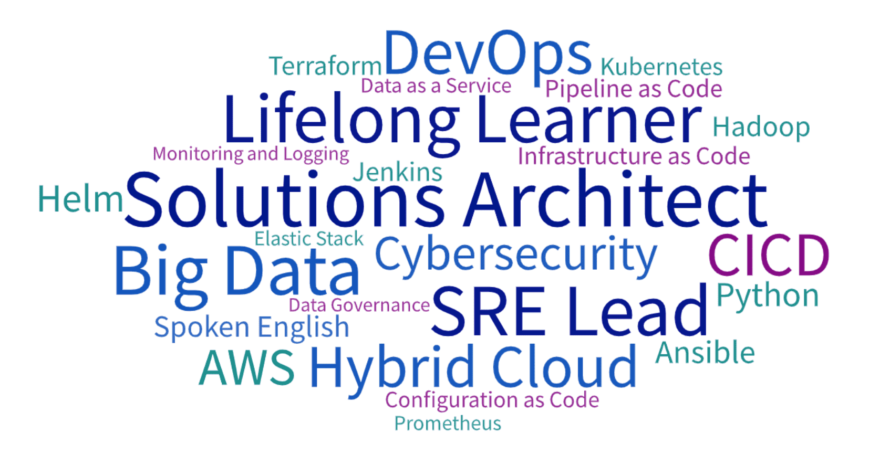

### 关于网站

<i class="fas fa-seedling fa-fw"></i> 记录我人生新阶段的成长历程

### 关于我

+ <i class="fas fa-user-tie fa-fw"></i>领域：<i class="fas fa-cloud-upload-alt fa-fw"></i> 混合云 <i class="fas fa-layer-group"></i> 大数据 <i class="far fa-object-group fa-fw"></i> 运维架构 <i class="fas fa-user-shield fa-fw"></i> 网络安全
+ <i class="fas fa-heart fa-fw"></i>爱好：<i class="fas fa-book-reader fa-fw"></i> 阅读 <i class="fas fa-running fa-fw"></i> 健身 <i class="fab fa-fly fa-fw"></i> 旅游 <i class="fas fa-film fa-fw"></i> 电影

### [TO DO LIST]^(始于2021年10月)

<i class="fas fa-tasks fa-fw"></i> **核心任务**
- [x] <i class="fas fa-dharmachakra fa-fw"></i> CKA
- [x] <i class="fas fa-language fa-fw"></i> 英语六级
- [ ] <i class="fas fa-graduation-cap fa-fw"></i> 论文
- [ ] <i class="fas fa-user-shield fa-fw"></i> CISSP
- [ ] <i class="fas fa-users-cog fa-fw"></i> PMP
- [ ] <i class="fas fa-language fa-fw"></i> 雅思7.0
- [ ] <i class="fas fa-user-tag fa-fw"></i> CDMP
- [ ] <i class="fas fa-dharmachakra fa-fw"></i> CKS
- [ ] <i class="fas fa-cogs fa-fw"></i> ITIL 4 MP

<i class="fas fa-book-open fa-fw"></i> **读书清单**

- [x] 向死而生：我修的死亡学分
- [x] 自控力
- [x] 刻意练习：如何从新手到大师
- [x] 番茄工作法图解：简单易行的时间管理方法
- [x] 刻意放手：向最幸福的人学习幸福
- [x] 你当像鸟飞往你的山
- [x] 影响力
- [x] 非暴力沟通
- [ ] 小岛经济学：鱼、美元和经济的故事
- [ ] 穷爸爸，富爸爸
- [ ] 福格行为模型
- [ ] 必然
- [ ] 噪声：人类判断的缺陷
- [ ] 失控：机器、社会与经济的新生物学
- [ ] 精益创业
