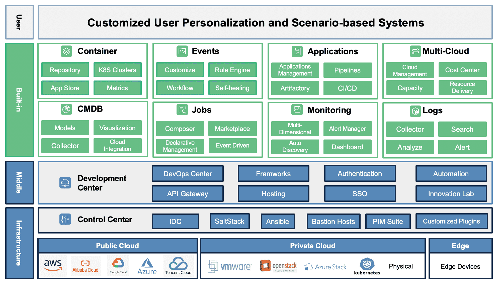

A multi-cloud strategy allows companies to select different cloud services from different providers.

<!--more-->

## Reasons

A multi-cloud strategy allows companies to select different cloud services from different providers, implement a multi-cloud environment for the following reasons:

+ Choice
  
  Multi-cloud infrastructure can combine the best services that each platform offers, thereby optimizing returns on cloud investments, gives flexibility and the ability to avoid vendor lock-in.

+ Disaster Avoidance
  
  As proverb that says don’t put all of your eggs in the same basket. If one vendor happens to have infrastructure meltdown, attack or geopolitical risks, can quickly switch to another cloud service provider.

+ Compliance
  
  Multi-cloud environments can help enterprises achieve the goals for governance, risk management and compliance regulations.

## Architecture

After investigated many multi-cloud platforms from different companies, then I found the following diagram of **Fully Functional Multi-Cloud Management Platform Architecture** from [[OpsAny]^(Make Ops Perfect)](https://www.opsany.com).

It shows the various service modules which need to be considered in a multi-cloud architecture, and it is easy to see that there are many difficulties and challenges in building a multi-cloud management platform.

