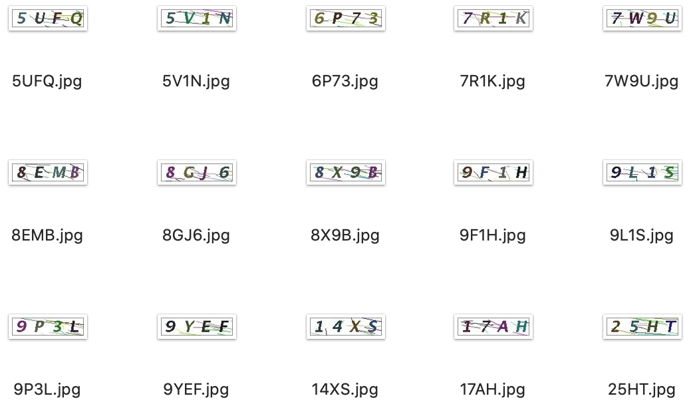
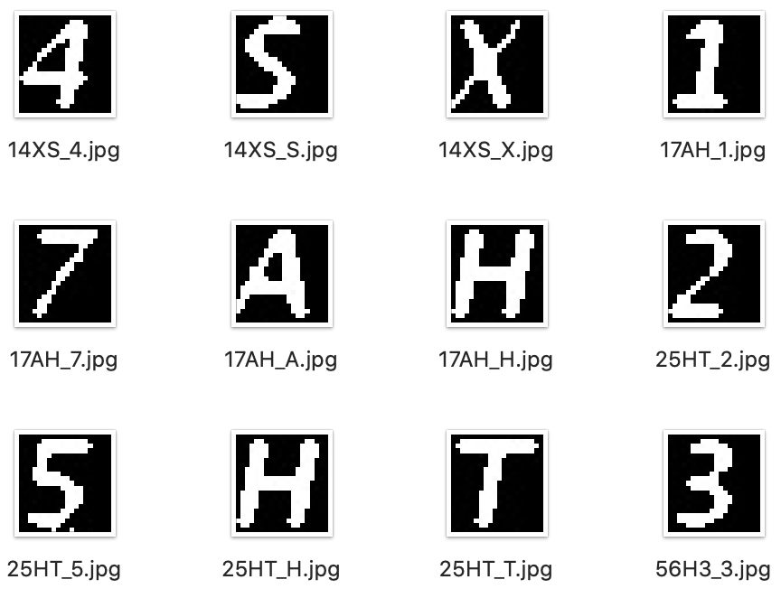

在通过OpenCV完成验证码识别的过程中，所学习到的识别原理和流程，还是很有价值的。

<!--more-->

## 背景

公司内部有着良好的学习分享氛围，不定期的会举办各种极客大赛，这次的比赛内容是验证码识别。

虽然在实际工作中，我几乎没有做过数据分析相关的内容，但我之前学习过几门数据挖掘、机器学习和人工智能相关的选修课程，在理论方面算是有了一些粗浅的理解，也想借着这个机会锻炼一下自己，所以报名参加了比赛。

## 思路

刚开始，我还想着从GitHub上找一些现成的代码，然后修改一下，调整一些参数就直接拿来用。在这个过程中尝试了很多看似高大上的程序，大多数都是号称无需做任何特征工程，就可以训练和识别的，但实际的结果都很差，甚至是惨不忍睹。

在比赛期间，不断有同事在群里秀出自己的阶段性成果，而且他们都做了特征工程，于是我也参考了这方面的文章，最后顺利完成，识别率达到了99%以上，主要思路如下：

+ 1.收集样本
     
    收集一定数量的验证码图片样本，此次的验证码识别大赛仅提供了100张图片样本给所有的参赛选手。
  
    > 理论上图片样本的数量越多，可以分析出的有效特征就越多，构建出的模型就越准确。数据比模型更重要，机器学习模型的表现高度依赖于数据量，选择对的模型只是其次，正所谓巧妇难为无米之炊。
    
    > 这个过程类似于在编写一本教科书之前，需要先收集大量的参考资料。

+ 2.特征工程

    使用OpenCV库对验证码图片样本进行分析，进行一系列有针对性的处理，去除验证码图片中的各种随机线条等噪音，突出验证码图片中的字符如5UFQ。
  
    > 特征工程是将原始数据转化成更好的表达问题本质的特征的过程，目的是发现重要特征。
    
    > 这个过程中，原始图片样本类似参考资料，最后用于机器学习的训练集数据类似教科书。编写一本教科书，需要从海量的参考资料中剔除无用的信息，反复校对，最后形成一本易于学生接受的教科书。

+ 3.人工标注
  
    操作方式很简单，将每个原始图片样本人工识别并重命名为验证码的字符内容如5UFQ.jpg，再将经过特征工程后的图片切割为单个字符的图片，分别保存为：5UFQ_5.jpg，5UFQ_U.jpg，5UFQ_F.jpg，5UFQ_Q.jpg，用于后面的模型训练。

    > 目前成熟的机器学习技术主要还是监督式学习，监督式学习的核心就是把已知的数据特征提供给机器进行训练。
    
    > 数据样本类似教课书中的段落，数据特征类似老师圈出的重点内容，机器学习程序类似学生，突出重点内容能让学生更快更好的掌握知识。


+ 4.训练模型

    将上面的所有单个字符的图片作为训练集，每个图片的字符作为标签，构造一个图片与标签的映射表，然后用OpenCV自带的KNN相似度模型进行机器学习，最终训练出可识别相似的验证码图片的有效模型。

    > 这个过程中，机器学习程序类似学生，将书中的段落和老师圈出的重点内容在脑海里进行关联，然后反复学习、理解、消化，最后触类旁通，掌握了举一反三的能力。

+ 5.识别图片

    将一定数量的原始图片样本作为测试集数据，通过特征工程去除噪音，然后直接使用训练好的模型进行匹配识别，并将识别后的结果与图片文件名（如00243af2b3545fd4c869d1c155c08d3f.png,LTEH）依次存入一个CSV文件中。

    > 类似于学生通过举一反三的能力对新知识进行归纳总结，并像老师一样圈出重点内容的过程。

## 详解

### 1. 收集样本

在实际的工作中，应该收集足够多数量的验证码图片样本，但此次的验证码识别大赛为了不背离初衷，防止大家直接通过网上现有的代码，通过使蛮力的方法炼丹把结果算出来，仅提供了100张图片样本给所有的参赛选手。


### 2. 特征工程

以字符内容为5UFQ的验证码图片为例，首先导入所需的Python库：

```python
# 用于获取本地目录与文件
import os
# 用于构造数据集
import numpy as np 
# 用于显示图片
from matplotlib import pyplot as plt
# OpenCV库用于图片的特征工程与KNN模型训练
import cv2
```

读取并显示原始图片样本：

```python
# 文件路径
filepath='imgs/train/5UFQ.jpg'
# OpenCV读取文件
im=cv2.imread(filepath)
# 显示图片
plt.imshow(im[:,:,[2,1,0]])
plt.show()
```


[RGB](https://baike.baidu.com/item/RGB/342517)即代表红（Red）、绿（Green）、蓝（Blue），又称为三原色光，电脑屏幕上的所有颜色，都由这三种色光按照不同的比例混合而成的，屏幕上的任何一个颜色都可以由一组RGB值来记录和表达。

任何颜色都由红、绿、蓝三原色组成，而[灰度图](https://baike.baidu.com/item/%E7%81%B0%E5%BA%A6%E5%9B%BE/8105733)只有一个通道，有256个灰度等级，255代表全白，0表示全黑。

将图片由RGB转换为灰度图，就是将图片的色彩信息去掉，转换为只有黑白信息。

```python
# 将图片转成灰度图
im_gray = cv2.cvtColor(im, cv2.COLOR_BGR2GRAY)
# 显示图片
plt.imshow(im_gray,cmap="gray")
plt.show()
```


图像的二值化处理就是将图像上的点的灰度置为0或255，以此呈现出明显的黑白效果。

```python
# 将图片做二值化处理，阈值设定为127，将像素值大于127的置为0，小于127的置为255
ret, im_inv = cv2.threshold(im_gray,127,255,cv2.THRESH_BINARY_INV)
# 显示图片
plt.imshow(im_inv,cmap="gray")
plt.show()
```


[高斯模糊](https://baike.baidu.com/item/%E9%AB%98%E6%96%AF%E6%A8%A1%E7%B3%8A)是在图像处理软件中广泛使用的处理效果，通常用它来对图片进行降噪以及降低细节层次，其视觉效果就像是经过一个半透明的磨砂屏幕在观察图像。

```python
# 构建卷积核的数据集，实现模糊成像的效果
kernel = 1/16*np.array([[1,2,1], [2,4,2], [1,2,1]])
# 使用高斯模糊对图片进行降噪
im_blur = cv2.filter2D(im_inv,-1,kernel)
# 显示图片
plt.imshow(im_blur,cmap="gray")
plt.show()
```


再将经过高斯模糊后的图片进行二值化处理，消除条纹等噪音信息，通过反复测试，最终确定阈值为185时，去噪的效果最佳。

```python
# 将图片做二值化处理，阈值设定为185，将像素值大于185的置为0，小于185的置为255
ret, im_res = cv2.threshold(im_blur,185,255,cv2.THRESH_BINARY)
# 显示图片
plt.imshow(im_res,cmap="gray")
plt.show() 
```


### 3. 人工标注

对每个原始图片样本进行人工识别，并重命名为验证码的字符内容。



通过观察发现，在所有的验证码图片样本中，每个字符在图片中所处的区域都非常一致，因此大大降低了判断字符区域并切割图片的难度。

```python
    # 将观察到的四个字符在图片中所处的区域信息保存到字典中
    roi_dict[0] = im_res[4:25, 8:28]
    roi_dict[1] = im_res[4:25, 38:58]
    roi_dict[2] = im_res[4:25, 68:88]
    roi_dict[3] = im_res[4:25, 98:118]

    return roi_dict
```

再将经过特征工程后的图片切割为单个字符的图片，分别保存，作为训练集样本用于后面的模型训练。

```python
def cut_img(train_dir,cut_dir,suffix):
    # 浏览训练集图片样本的目录
    for root,dirs,files in os.walk(train_dir):
        for f in files:
            # 获取文件路径
            filepath = os.path.join(root,f)
            # 检查文件名后缀
            filesuffix = os.path.splitext(filepath)[1][1:]
            if filesuffix in suffix:
                # 通过特征工程处理图片并获取每个字符所在区域的信息
                roi_dict = fix_img(filepath)
                # 将图片按照获取到的每个字符所在区域的信息切割为不同的图片，分开保存
                for i in sorted(roi_dict.keys()):
                    cv2.imwrite("{0}/{1}_{2}.jpg".format(cut_dir,f.split('.')[0],f[i]),roi_dict[i])
    
    # 关闭OpenCV的写操作
    cv2.waitKey(0)
    
    return True
```



### 4. 训练模型

将上面的所有单个字符的图片作为训练集，每个图片的字符作为标签，构造一个图片与标签的映射表，加载数据。再用OpenCV自带的KNN相似度模型进行机器学习，训练出可识别相似的验证码图片的模型。

```python
def train_model(cut_dir,suffix):
    # 创建一个空的数据集存放验证码的图片信息
    samples = np.empty((0, 420))
    # 创建一个控的标签列表
    labels = []
    
    # 浏览单个字符的图片训练集的目录
    for root,dirs,files in os.walk(cut_dir):
        for f in files:
            filepath = os.path.join(root,f)
            filesuffix = os.path.splitext(filepath)[1][1:]
            if filesuffix in suffix:
                filepath = os.path.join(root,f)
                # 读取图片的标签
                label = f.split(".")[0].split("_")[-1]
                labels.append(label)
                # 将验证码的图片信息存放到数据集中
                im = cv2.imread(filepath, cv2.IMREAD_GRAYSCALE)
                sample = im.reshape((1, 420)).astype(np.float32)
                samples = np.append(samples, sample, 0)
                samples = samples.astype(np.float32)

    # 将数据集与标签进行映射
    unique_labels = list(set(labels))
    unique_ids = list(range(len(unique_labels)))
    label_id_map = dict(zip(unique_labels, unique_ids))
    id_label_map = dict(zip(unique_ids, unique_labels))
    label_ids = list(map(lambda x: label_id_map[x], labels))
    label_ids = np.array(label_ids).reshape((-1, 1)).astype(np.float32)

    # 使用OpenCV自带的KNN相似度模型进行机器学习
    model = cv2.ml.KNearest_create()
    model.train(samples, cv2.ml.ROW_SAMPLE, label_ids)
    
    # 返回训练好的模型，数据ID与标签的映射字典
    return {'model':model,'id_label_map':id_label_map}
```

### 5. 识别图片

读取测试集图片样本，通过特征工程去除噪音，然后使用训练好的模型进行匹配识别，并将识别后的结果与图片文件名依次存入一个CSV文件中。

```python
def rek_img(model_dict,rek_dir,suffix,results_csv):
    # 获取训练好的模型
    model = model_dict['model']
    # 获取模型中的数据ID与标签的映射字典
    id_label_map = model_dict['id_label_map']
    label_dict = {}
    
    # 浏览测试集图片的目录
    for root,dirs,files in os.walk(rek_dir):
        for f in files:
            filepath = os.path.join(root,f)
            filesuffix = os.path.splitext(filepath)[1][1:]
            if filesuffix in suffix:
                # 通过特征工程处理图片并获取每个字符所在区域的信息
                roi_dict = fix_img(filepath)
                # 对每个字符所在区域的信息进行处理
                for i in sorted(roi_dict.keys()):
                    # 将字符所在区域的信息转换为数据集格式
                    sample = roi_dict[i].reshape((1, 420)).astype(np.float32)
                    # 通过训练好的模型匹配识别出最相似的数据集，并返回数据ID
                    ret, results, neighbours, distances = model.findNearest(sample, k = 3)
                    # 通过数据ID查询出对应的标签，并写入到字典中
                    label_id = int(results[0,0])
                    label = id_label_map[label_id]               
                    label_dict[i] = label
                
                # 将标签字典中的值依次取出，显示为验证码图片中的四个字符
                result_str = ''.join(str(v) for k,v in sorted(label_dict.items()))
                # 将测试集图片的文件名与识别出的字符以逗号分割存入到CSV中
                with open(results_csv, "a") as myfile:
                    myfile.write("{0},{1}\n".format(f,result_str))
                myfile.close()

    return True
```


## 总结

由于此次比赛给出的验证码图片样本特征都比较明显，比较容易进行特征工程，到最后，即使用了一万张验证码图片作为测试集，很多同事的识别准确率也都达到了90%以上，而第一名的正确率甚至达到了令人发指的100%。

对我来说，在通过OpenCV完成验证码识别的过程中，所学习到的识别原理和流程，还是很有价值的。

## 参考

源码地址：[captchas_opencv_rek](https://github.com/mcsrainbow/captchas_opencv_rek)

参考文章：[Python3 识别验证码（opencv-python）](https://www.cnblogs.com/lizm166/p/9969647.html)