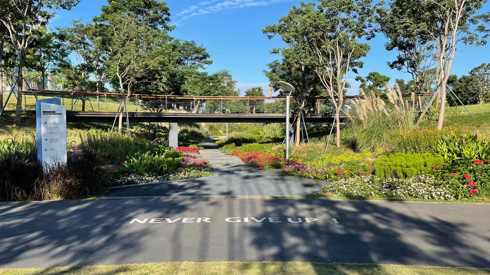

# Cherish the Time to Meet A Bright Future

I will keep this state, no more slacking off, and be positive for every beautiful day ahead.

<!--more-->

## Time

A few days ago, I helped my cousin download some geospatial programming materials, then we chatted for a while.

I shared with her how my life has been going lately, which is a regular daily routine of rest, exercise, reading and studying, which made her very envious. She said: "I really envy you for having so much time to study, you should cherish it."

My cousin worked for the Chinese Academy of Sciences for a long time after she graduated with her PhD. In the last few years, she has changed her job to be a teacher in a university.

She is very capable and wants to do many things, but she does not have enough time. She said: "I'm too busy, I have a lot of ideas but no enough time and energy to work on them, there are a bunch of things I need to deal with, and I have to take care of my kid."

Her words reminded me of a quote from my college dean in a class last year: "Now my children are living abroad and my husband is very busy. I really feel so happy! Because I can finally have a lot of time to devote to the topics I want to research and keep delving into them, which also makes it easier for me to produce good results."

After I forwarded it to my cousin, she said, "Haha, many people would find such days lonely, but of course I would feel very happy, I enjoy the state of being able to continue to work all day."

## Reflection

Back to myself, it has been more than two years since I left Chengdu and came to Shenzhen. I have grown a lot in the past two years, but have not taken care of my family. I didn't take the responsibility for the roles as a husband, a father and a son.

Although I kept saying it's all about being able to give my family a better life, and I felt that way inside. But I still wasted too much time and neglected my health in the past two years.

I should really wake up and realize how rare it is to have a lot of free time and energy in this middle age! I should spend as much of this precious time as possible on study and exercise, to gain knowledge faster and have a healthy body, so that I can really live up to the time, and create a better life for my family!

## Future

This morning, I shared a message to my friends: "Go to bed early, wake up early, read a few pages, memorize dozens of English words, go out leisurely, breathe fresh air, feel the warm sun shining on my body, look at the blue sky and white clouds, listen to the Geek Time App, sometimes walk, sometimes jog, feel the greenery along the way, go through the sports park with a good atmosphere for exercise, enter the company in good spirits and start a brand new day!"

This is a true record of how I felt every morning in the last two weeks, I will keep this state, no more slacking off, and be positive for every beautiful day ahead.

