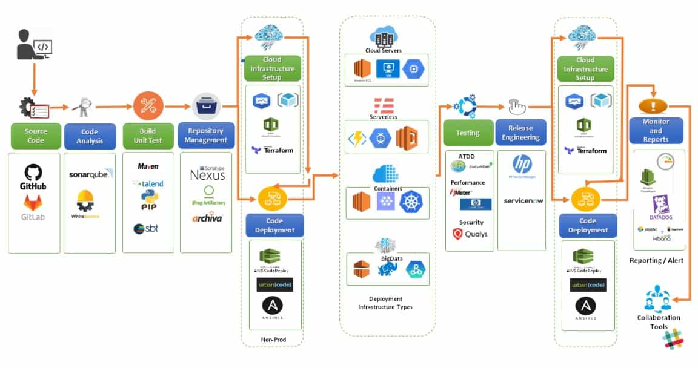
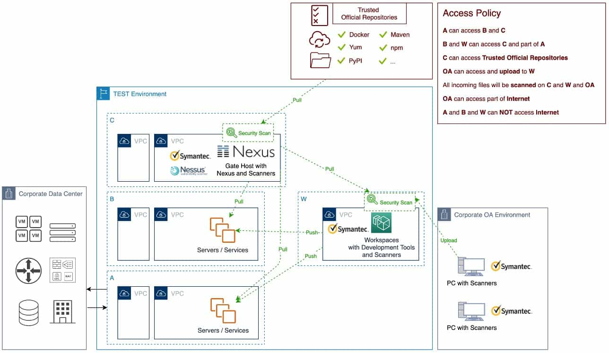

# DevOps CICD Pipeline in Action 

There are differences in the most appropriate CICD pipelines in different environments, especially the toolchains, but the general process and thinking should be similar.

<!--more-->

## Background

At the beginning of the project, the architect asked us to design a DevOps CICD (Continuous Integration, Continuous Deployment/Delivery) solution to improve productivity.

By taking some best practices into account and combining them with our own situation, we have designed a DevOps CICD pipeline which is more general and can balance security, audit, and the ability to take over existing on-premises infrastructure and services.

This solution has been successfully implemented and rolled out to other projects within the company.

## What is DevOps

### 1. The car industry

Everyone knows that most factories already have the automation assembly lines for their products. 

It is a well-known fact that the car industry went through an evolution and perfected a highly efficient approach to manufacturing cars. It went from highly custom cars built manually, to automated parts production with manual assembly, then to fully automated assembly lines. 

The car industry perfected a very lean manufacturing process. Compare with the car industry, our traditional software development models has already fell behind a lot.

### 2. DevOps is a culture

What is DevOps?

Some people may think of that DevOps is a set of software and tools which can make the development and deployment better.

DevOps is more than that, DevOps is a culture, it’s more about the Team and Organization, DevOps is a collaboration of Dev and Ops. The team should work together to design automation processes about the development, testing and deployment, and fix issues.

### 3. DevOps toolchains

The DevOps lifecycle starts with plan, build, continuous integration, and deploy, operate, then feedback and plan again. Around every part of this lifecycle, there are lots of applications and services.

## Disadvantages of Traditional Development

### 1. Seven types of waste for manufacturing

For manufacturing, it‘s every easy to waste time and resources on over production, transport, movement, over processing, waiting, inventory and products defects. Just because most of them still require manual works and no continuous deployment processes.

### 2. Disadvantages of traditional software development models

For the traditional software development models, there are also some disadvantages.

+ Manual Intervention

  Such interventions often lead to non-repeatable procedures and introduce human errors. Manual intervention is also a hindrance to agility especially when it comes to testing and deployment.

+ Inconsistent Environment
  
  Teams often waste days and weeks fixing bugs that are caused by inconsistent environment, wasting resources and time.

+ Restricted Monitoring
  
  They are solely dependent on manual checks performed by developers. This process introduces errors and delays the delivery or roll out time of products.

+ Lack of Shared Ownership
  
  Traditional software development models lack the concept of shared ownership, which create communication problems in organizations. 

## DevOps CICD Best Practices

### 1. Lightweight and easy

This is a lightweight and easy CICD pipeline solution by GitLab + Docker + Ansible from a fast-growing startup. GitLab is a source code management and also a continuous integration tool, Docker for containers and Ansible for configuration as code.

### 2. All on Kubernetes

In this solution, it suggests to build the CICD pipeline based on cloud services and Kubernetes. This is a popular solution which named "All on Kubernetes" and many internet companies use this solution.

But "All on Kubernetes" requires all applications to be containerized, it is not friendly for complex environments and the traditional software.

### 3. IBM DevOps architecture

The DevOps solution of IBM suggests to use DevOps and Cloud platform to help organizations to accelerate the applications development and delivery lifecycle.

It is a very good architecture to tell all the necessary steps and parts in DevOps. More details on https://www.ibm.com/cloud/architecture/architectures/devOpsArchitecture

### 4. End-to-end CICD pipeline

This end-to-end delivery pipeline of continuous integration and deployment across leading cloud platforms. In each step, it suggests the popular services and tools, and including most steps in the IBM DevOps architecture.

## Better DevOps CICD for Our Own

### 1. DevSecOps

What we most concern is security, so we need the DevSecOps, other than DevOps.

The DevSecOps does not have to sacrifice automation processes, it only needs to audit them before changes are implemented.

### 2. Deliver to Test environment

To deliver objects through a secure path to Test environment, this Test environment needs four networks: A, B, C and W.

+ A can connect to Data Center and shared services like JIRA, GitLab, and Nexus.
+ B can create servers and deploy services.
+ C can connect to some trusted official repositories, such as Maven, and the Nexus is integrated with security scan tools such as Symantec and Nessus.
+ W can develop software under the security scan and audit.

In this way, we could ensure that all the packages in the test environment are scanned and secure.

### 3. Our DevSecOps CICD pipeline

This is the End-to-End DevSecOps CICD pipeline for our own.

It includes all necessary steps, across three different environments, with the most popular automation tools and Cloud services, including the infrastructure as code and configurations as code, integrates with security tools, with the manual approve function based on the tests and security reports.

It includes the following items:

+ Project Management

  Think about a story, document it on Confluence and create tasks on JIRA, integrate JIRA with GitLab.

+ Code Management
  
  Do the Code Review, push the codes to GitLab, and GitLab will automatically trigger the related Jenkins jobs to do the Code Analysis, Build and Unit Test, then deploy the packages to Nexus repository.

+ Artifact Management
  
  Automatically scan the packages in Nexus with Nessus.

+ Infrastructure as Code and Configuration as Code

  Check whether the required infrastructure is ready or not, if not ready, create the infrastructure as code automatically, then deploy the packages and configurations to the servers or Kubernetes clusters.

+ Integration Tests and Security Tests

  Scan the applications with security tools and test the availability.

+ Audit and Approval
  
  Audit the whole pipeline and wait for the manual review, when the release manager approved, automatically continue to run the deployment and integration tests in staging environment, then wait for another review and approval for the production release.

This DevSecOps CICD pipeline is more general and can balance security, audit, and the ability to take over existing on-premises infrastructure and services.

For sure, there are differences in the most appropriate CICD pipelines in different environments, especially the toolchains, but the general process and thinking should be similar.
