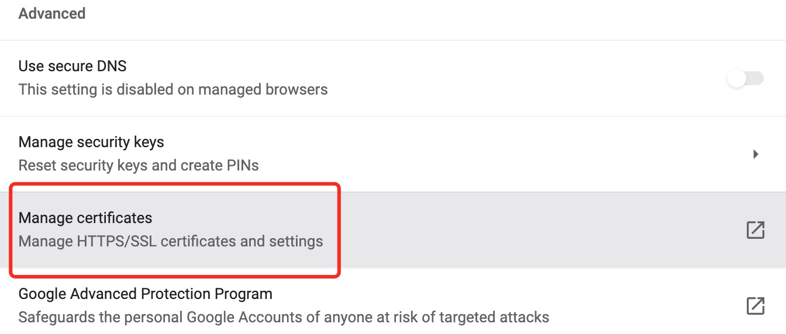

# How to Generate Self-signed SSL Certificates


It is also important to deploy HTTPS services for internal private domains.

<!--more-->

## Background

Today, almost all Internet sites and applications are already running on HTTPS site-wide, but many companies still have internal applications running on insecure HTTP.

In my current job, internal security requirements are very strict and all applications must support HTTPS. So I'm sharing my notes on how to generate self-signed SSL certificates for your reference.

## Generate SSL Certificates

### 1. Generate root certificate and import to OS
First, generate the `rootCA.heylinux.com.pem` set the encryption length to 4096 to meet Chrome's security level requirements.

```bash
openssl genrsa -out rootCA.heylinux.com.key 4096
```

Generate `rootCA.heylinux.com.pem`, set encryption `sha256`, valid days `3650`, organization `/C=CN/ST=Sichuan/L=Chengdu/O=HEYLINUX/OU=IT/CN=SRE`.

The `rootCA.heylinux.com.pem` will be used to generate the server key and the trusted root certification authorities of browsers such as Chrome.

The `-subj` parameter is more straightforward than the interactive steps.

```bash
openssl req -x509 -new -nodes -key rootCA.heylinux.com.key -sha256 -days 3650 -out rootCA.heylinux.com.pem -subj "/C=CN/ST=Sichuan/L=Chengdu/O=HEYLINUX/OU=IT/CN=SRE"
```

Import `rootCA.heylinux.com.pem` to OS via Chrome, so the Chrome could trust the server certificate generated based on the root certificate.



### 2. Generate server certificate

Create ssl.conf, enable `serverAuth` and `clientAuth`, wildcard DNS names as `*.heylinux.com` and `*.cloud.heylinux.com`.

```bash
vim ssl.conf
```

```ini
subjectAltName = @alt_names
authorityKeyIdentifier = keyid,issuer
keyUsage = digitalSignature,keyEncipherment,nonRepudiation,dataEncipherment
extendedKeyUsage = serverAuth,clientAuth
basicConstraints = CA:FALSE
subjectKeyIdentifier = hash

[alt_names]
DNS.1 = *.heylinux.com
DNS.2 = *.cloud.heylinux.com
```

Generate server certificate Key `star.heylinux.com.key`, organization `/C=CN/ST=Sichuan/L=Chengdu/O=HEYLINUX/OU=IT/CN=*.heylinux.com`.

```bash
openssl req -new -nodes -out star.heylinux.com.csr -newkey rsa:4096 -keyout star.heylinux.com.key -subj "/C=CN/ST=Sichuan/L=Chengdu/O=HEYLINUX/OU=IT/CN=*.heylinux.com"
```

Generate `star.heylinux.com.crt`, set encryption `sha256`, valid days `3650`.

```bash
$ openssl x509 -req -in star.heylinux.com.csr -CA rootCA.heylinux.com.pem -CAkey rootCA.heylinux.com.key -CAcreateserial -out star.heylinux.com.crt -days 3650 -sha256 -extfile ssl.conf
```

View server certificate information

```bash
openssl x509 -text -noout -in star.heylinux.com.crt
```

```
Certificate:
    Data:
        Version: 3 (0x2)
        Serial Number:
            10:f8:04:91:06:d8:4a:eb:46:ee:90:80:b4:9c:94:4e:ac:60:7b:3e
        Signature Algorithm: sha256WithRSAEncryption
        Issuer: C = CN, ST = Sichuan, L = Chengdu, O = HEYLINUX, OU = IT, CN = SRE
        Validity
            Not Before: Nov  7 04:38:21 2021 GMT
            Not After : Nov  5 04:38:21 2031 GMT
        Subject: C = CN, ST = Sichuan, L = Chengdu, O = HEYLINUX, OU = IT, CN = *.heylinux.com
        Subject Public Key Info:
            Public Key Algorithm: rsaEncryption
                RSA Public-Key: (4096 bit)
...
                Exponent: 65537 (0x10001)
        X509v3 extensions:
            X509v3 Subject Alternative Name:
                DNS:*.heylinux.com, DNS:*.cloud.heylinux.com
            X509v3 Authority Key Identifier:
                keyid:36:20:25:BA:1A:D9:36:A3:5C:E7:94:30:7F:76:D5:DF:5D:03:99:C9

            X509v3 Key Usage:
                Digital Signature, Non Repudiation, Key Encipherment, Data Encipherment
            X509v3 Extended Key Usage:
                TLS Web Server Authentication, TLS Web Client Authentication
            X509v3 Basic Constraints:
                CA:FALSE
            X509v3 Subject Key Identifier:
                DB:0D:E8:00:A4:3E:95:71:26:1A:0B:57:4C:3C:3B:33:D3:67:F0:16
...
```
### 3. Generate certificate bundles in different formats

Certificate bundle usually contains multiple server certificates.

Generate `star.heylinux.com.p12` in `PKCS12`, set passphrase `P_Ss0rdT`, alias `heylinux_com`. It could be used for servers such as Tomcat.

```bash
openssl pkcs12 -export -in star.heylinux.com.crt -inkey star.heylinux.com.key -password pass:P_Ss0rdT -name heylinux_com -out star.heylinux.com.p12
```

Convert `star.heylinux.com.p12` to `star.heylinux.com.jks` in `JKS`, set passphrase `P_Ss0rdT`, alias `heylinux_com`. It could be used for servers such as Tomcat.

```
$ keytool -importkeystore -deststorepass P_Ss0rdT -destkeystore star.heylinux.com.jks -srcstorepass P_Ss0rdT -srckeystore star.heylinux.com.p12 -srcstoretype PKCS12
```

Convert `star.heylinux.com.p12` to `star.heylinux.com.pem` in `PEM`, alias `heylinux_com`,no passphrase. It could be used for servers such as Apache、Nginx、HAProxy and AWS ELB.

```
openssl pkcs12 -password pass:P_Ss0rdT -in star.heylinux.com.p12 -out star.heylinux.com.pem -nodes
```

### 4. Convert root certificate to JKS format

Convert `rootCA.heylinux.com.pem` to `rootCA.heylinux.com.jks`, alias `heylinux_com`, for Java applications to verify server certificate.

The principle is similar to the above "import the root certificate to OS via Chrome, so the Chrome could trust the server certificate generated based on the root certificate".

```bash
# Convert rootCA.heylinux.com.pem to rootCA.heylinux.com.der
openssl x509 -in rootCA.heylinux.com.pem -out rootCA.heylinux.com.der -outform der

# View rootCA.heylinux.com.der
keytool -v -printcert -file rootCA.heylinux.com.der

# Convert rootCA.heylinux.com.der to rootCA.heylinux.com.jks, alias heylinux_com
keytool -importcert -alias heylinux_com -keystore rootCA.heylinux.com.jks -storepass P_Ss0rdT -file rootCA.heylinux.com.der

# View rootCA.heylinux.com.jks
keytool -keystore rootCA.heylinux.com.jks -storepass P_Ss0rdT -list
```

## Convert and View SSL Certificates

### 1. From P7B to PEM

Convert `SubCA_2.p7b` to `rootCA.heylinux.com.pem`.

```bash
openssl pkcs7 -inform DER -print_certs -in SubCA_2.p7b -out rootCA.heylinux.com.pem
```

### 2. From PEM to JKS

Convert `rootCA.heylinux.com.pem` to `rootCA.heylinux.com.jks`.

```bash
# Convert rootCA.heylinux.com.pem to rootCA.heylinux.com.der
openssl x509 -in rootCA.heylinux.com.pem -out rootCA.heylinux.com.der -outform der

# Convert rootCA.heylinux.com.der to rootCA.heylinux.com.jks, alias heylinux_com
keytool -importcert -alias heylinux_com -keystore rootCA.heylinux.com.jks -storepass P_Ss0rdT -file rootCA.heylinux.com.der
```

### 3. From PFX(P12) to PEM

Convert `star.heylinux.com.pfx` to `star.heylinux.com.pem`, which including the items of `star.heylinux.com.key` and `star.heylinux.com.crt`.

```
openssl pkcs12 -password pass:P_Ss0rdT -nodes -in star.heylinux.com.pfx -out star.heylinux.com.pem
```

### 4. From P12 to JKS

Convert `star.heylinux.com.p12` to `star.heylinux.com.jks`, alias `heylinux_com`.

```bash
keytool -importkeystore -deststorepass P_Ss0rdT -destkeystore star.heylinux.com.jks -srcstorepass P_Ss0rdT -srckeystore star.heylinux.com.p12 -srcstoretype PKCS12 -alias heylinux_com
```

### 5. View certificates in different formats

```bash
# View rootCA.heylinux.com.pem and star.heylinux.com.pem
openssl crl2pkcs7 -nocrl -certfile rootCA.heylinux.com.pem | openssl pkcs7 -print_certs -text -noout
openssl crl2pkcs7 -nocrl -certfile star.heylinux.com.pem | openssl pkcs7 -print_certs -text -noout

# View star.heylinux.com.p12 
$ keytool -list -v -keystore star.heylinux.com.p12 -storepass P_Ss0rdT -storetype PKCS12

# View star.heylinux.com.jks
$ keytool -list -v -keystore star.heylinux.com.jks -storepass P_Ss0rdT
```

## TLS/SSL Certificates without Root Certificate

For applications such as NiFi, vsFTPd, the TLS/SSL certificates are mainly used for client and server verification, similar to the authentication between private and public keys in SSH, this kind of certificates could be used without the root certificate.

Generate server certificates `heylinux-ssl-keypair.key` and `heylinux-ssl-keypair.crt`, set encryption `sha256`, valid days `3650`, passphrase `P_Ss0rdT`, organization `/C=CN/ST=Sichuan/L=Chengdu/O=HEYLINUX/OU=IT/CN=SRE`.

```bash
# Generate heylinux-ssl-keypair.key and heylinux-ssl-keypair.crt
openssl req -x509 -newkey rsa:4096 -keyout heylinux-ssl-keypair.key -out heylinux-ssl-keypair.crt -days 3650 -sha256 -subj "/C=CN/ST=Sichuan/L=Chengdu/O=HEYLINUX/OU=IT/CN=SRE"

# Input password
Generating a RSA private key
....................................+++++
writing new private key to 'heylinux-ssl-keypair.key'
Enter PEM pass phrase: P_Ss0rdT
Verifying - Enter PEM pass phrase: P_Ss0rdT

# Convert certificates to certificate bundle heylinux-ssl-keypair.p12
openssl pkcs12 -export -in heylinux-ssl-keypair.crt -inkey heylinux-ssl-keypair.key -password pass:P_Ss0rdT -name heylinux_ssl_keypair -out heylinux-ssl-keypair.p12

# Input password
Enter pass phrase for heylinux-ssl-keypair.key: P_Ss0rdT

# View certificate bundle heylinux-ssl-keypair.p12
keytool -list -v -keystore heylinux-ssl-keypair.p12 -storepass P_Ss0rdT -storetype PKCS12
```

